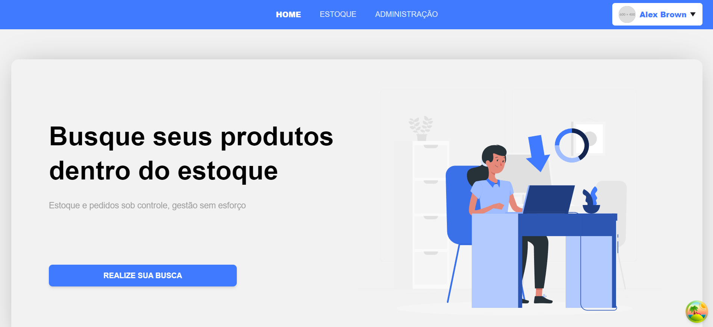

# Inventory Manager

This project is a system for managing product stocks. Here is the project's front-end, developed using JavaScript and Next.js.

## Índice

- [Installation](#installation)
- [Technologies](#Technologies)
- [Use](#use)
- [Tests](#tests)
- [Development](#development)
- [Images](#images)
- [Prototype](#prototype)
- [Deploy](#deploy)

## Technologies

- **Next.js:** Framework React for develop the Web application.
- **Typescript:** TypeScript is a strongly typed programming language that builds on JavaScript, giving you better tooling at any scale.

## installation

Follow the instruction below:

- Download and install node and npm in this site: [Link for site](https://nodejs.org/en/download)

For to check if the installation of node and npm was success:

```bash

  # Command for to check if the node is installed
  node --version
```

```bash

  # Command for to check if the npm is installed
  npm --version

```

- Clone the project

```bash

# Clone the repository by SSH
git clone git@github.com:ifpebj-ti/Front-Gerenciamento-Estoque.git


# Clone the repository by HTTPS
git clone https://github.com/ifpebj-ti/Front-Gerenciamento-Estoque.git

```

- Access project's directory:

```bash

  cd Front-Gerencimento-Estoque

```

- You need create the .env.local file, this file will have the API URL and the Next Auth configurations

```bash
# In Linux you can use the command "nano"

  nano .env.local

```

- Content for the file .env.local

```bash
# Copy and Past the following content in file .env.local, Don't forget to modify the variable's values:

  NEXTAUTH_SECRET="You may generate any hash code"
  NEXTAUTH_URL="URL that your Web application is running"
  API_URL="URL that your API is running"

```

Attention: If you have used the command "nano", don't forget the press ctrl+o for save this file, and ctrl+x to close the file in terminal.

- Insider the root project's directory, open the terminal and paste following command:

```bash
  npm i
```

- To running project used following command:

```bash
  npm run dev
```

## Use

- Access the link that showed in the terminal

## Tests

```bash
  npm run test
```

## Development

This project was development using some libraries, how:

- React Hook Form
- Tanstack Query
- Next Auth

## Images





## Prototype

Figma link: [Click here to access!](https://google.com.br)

## Deploy

[Project's link](http://137.131.180.24/login?callbackUrl=%2F)
